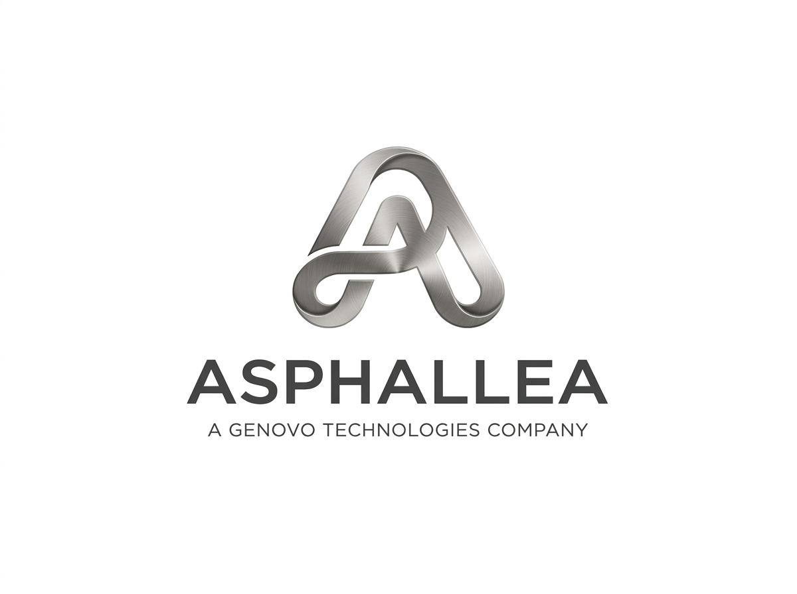

<p align="center">
  
</p>

<h1 align="center">Asphallea</h1>

**A security runtime that contains what your AI agent can do.**

Least-privilege sandboxing and a full audit trail for agent tool-execution, so a
hijacked agent cannot wreck your systems.


## The problem

An AI agent that runs code, calls tools, browses, and touches APIs is a new kind of
privileged process. It acts on its own, and it has none of the containment we built
for normal processes over the last fifty years. When an agent is prompt-injected or
its tools are poisoned, it can do anything its credentials allow. It can exfiltrate
data, delete infrastructure, call APIs, and spend money.

Asphallea wraps an agent's tool-execution layer and enforces a least-privilege
policy on every action, with a complete audit trail. A hijacked agent can only do
what the policy allows, and you can see everything it did.

## This is not guardrails

Asphallea does not judge or filter what the model says. It contains what the agent
does. This is an operating-systems problem wearing an AI costume: process
isolation, least privilege, syscall filtering, blast-radius containment. That
framing is the whole point. A pure-ML approach cannot give you kernel-level
containment. Asphallea does, on Linux, where it counts.

## Two tiers

**Policy tier.** Cross platform. Every tool call is intercepted, checked against a
declarative policy, allowed or denied deterministically, and logged. Works on
Linux, macOS, and Windows. This alone is useful.

**Containment tier.** For high-blast-radius tools that spawn processes, execute
code, or run shell commands, Asphallea contains them at the OS level using each
platform's own engine. Linux gets a Landlock filesystem allowlist, seccomp-bpf
syscall and network filtering, resource limits, and network-namespace isolation.
Windows gets an AppContainer filesystem allowlist and network deny inside a Job
Object that bounds memory, CPU, and process count and guarantees the whole process
tree is killed. macOS gets a Seatbelt profile that allowlists the filesystem and
denies network. This is the part a pure-ML competitor cannot replicate.

## Install

```sh
pip install asphallea
```

The release wheels are platform specific and bundle a prebuilt, code-signed
`asphallea-run` core binary, so there is no Rust toolchain to install and nothing to
compile. Before it runs that binary, the SDK verifies its SHA-256 against a manifest
shipped inside the wheel and refuses a binary that does not match, so a swapped or
patched core is rejected and the run fails closed. See
[`SECURITY.md`](SECURITY.md) for the trust model.

To build the core yourself instead, see [`core/`](core) and point the SDK at your
binary with `ASPHALLEA_CORE_BIN`.

## Quickstart

Wrap a tool in a least-privilege policy in about five minutes. This uses only the
policy tier, so it runs the same on every platform.

```python
import os, tempfile
from asphallea import AuditLog, Policy, PolicyViolation, guard

workspace = tempfile.mkdtemp(prefix="asphallea-")
with open(os.path.join(workspace, "notes.txt"), "w") as fh:
    fh.write("hello from inside the workspace\n")

# Least privilege: may call read_file, and only under the workspace.
policy = (
    Policy.builder("quickstart")
    .allow_tools("read_file")
    .read_paths(workspace)
    .deny_network()
    .build()
)

@guard(policy, tool="read_file", reads="path", audit=AuditLog("audit.jsonl"))
def read_file(path: str) -> str:
    with open(path) as fh:
        return fh.read()

# Allowed: inside the workspace.
print(read_file(os.path.join(workspace, "notes.txt")))

# Denied: outside the workspace. A hijacked agent reaching for your SSH key
# is stopped here, deterministically.
try:
    read_file(os.path.expanduser("~/.ssh/id_rsa"))
except PolicyViolation as exc:
    print("denied:", exc.decision.rule, exc.decision.reason)
```

The full script is in [`examples/quickstart.py`](examples/quickstart.py). Run it:

```sh
python examples/quickstart.py
```

## The containment tier (Linux)

For tools that run shell commands or execute code, the policy tier gates whether the
tool runs. The containment tier contains what it then does.

Build the Rust core once:

```sh
cd core
cargo build --release
export ASPHALLEA_CORE_BIN="$PWD/target/release/asphallea-run"
```

Then run commands under OS enforcement:

```python
from asphallea import Policy, sandbox

policy = (
    Policy.builder("shell")
    .read_paths("./workspace")
    .write_paths("./workspace/out")
    .deny_network()
    .limits(cpu_seconds=10, memory_mb=512, max_processes=64)
    .build()
)

result = sandbox.run(["bash", "-c", "echo hello > ./workspace/out/ok.txt"], policy=policy)
print(result.returncode, result.controls)

# This is contained: the write lands outside the allowlist and Landlock blocks it.
blocked = sandbox.run(["bash", "-c", "cat ~/.ssh/id_rsa"], policy=policy)
print(blocked.returncode, blocked.stderr)  # non-zero, permission denied
```

By default `sandbox.run` **fails closed**. If OS containment is not available (not
Linux, no core binary, kernel too old), it refuses to run the command and tells you
exactly what is missing. Pass `allow_degraded=True` to run without containment; that
is logged loudly on every call so it can never pass silently.

Check what your environment can actually enforce:

```python
from asphallea import capabilities
print(capabilities().explain())
```

## The injection demo

[`examples/injection_demo.py`](examples/injection_demo.py) is the whole pitch in one
file. A small agent with a shell tool and a file tool is given a prompt-injected
instruction that tries to steal a secret and delete a directory outside its
workspace. It runs twice: once unguarded, where the attack succeeds against a
throwaway sandbox directory, and once wrapped in Asphallea, where both actions are
denied and contained, with the audit log printed.

```sh
python examples/injection_demo.py
```

## Policy model

A policy declares, per policy:

- which tools may be called
- filesystem paths that are readable and writable
- whether the network is allowed
- per-tool call-count and rate limits
- a wall-clock timeout per call
- a spend cap, modeled as a maximum number of invocations of a paid tool
- OS resource limits for the containment tier

Build it fluently or load it from YAML. See
[`policies/example.yaml`](policies/example.yaml).

```python
from asphallea import Policy

policy = Policy.from_yaml("policies/example.yaml")
```

## Audit log

Every decision is written as one JSON object per line (JSONL), append-only. Each
record carries the timestamp, tool, arguments, the allow or deny decision, the
reason, and the exact policy rule that fired. A redaction hook scrubs likely secrets
before anything is written.

```json
{"timestamp": "2026-07-12T18:20:01Z", "tier": "policy", "tool": "read_file", "decision": "deny", "rule": "read_paths", "reason": "read path '/home/u/.ssh/id_rsa' is not under an allowed read prefix", "policy": "quickstart", "args": ["/home/u/.ssh/id_rsa"], "kwargs": {}}
```

Swap in your own audit sink or redactor. See [`asphallea/audit.py`](asphallea/audit.py).

## LangChain and LangGraph

Wrap existing LangChain or LangGraph tools with a policy. The adapter is duck-typed,
so it works whether or not `langchain` is installed.

```python
from asphallea import Policy, Engine, AuditLog
from asphallea.integrations.langchain import guard_tool

policy = Policy.builder("lc").allow_tools("read_file").read_paths("./workspace").build()
engine = Engine(policy)

safe_tool = guard_tool(read_file, engine, reads="path", audit=AuditLog("audit.jsonl"))
# hand `safe_tool` to your agent or graph in place of the original
```

OpenAI and Anthropic tool-calling adapters are fast-follow.

## Honest platform support

Each OS has its own containment engine, and the coverage differs. Asphallea reports
what it actually enforces per dimension and never claims more. When a policy needs a
dimension the local backend cannot deliver, it fails closed rather than run
partially contained.

| Capability | Linux 5.13+ | Windows | macOS |
| --- | --- | --- | --- |
| Policy tier: allow/deny, allowlists, rate, spend, timeout | yes | yes | yes |
| Audit trail (JSONL) | yes | yes | yes |
| Filesystem allowlist at the OS level | yes (Landlock) | yes (AppContainer) | yes (Seatbelt) |
| Network deny at the OS level | yes (seccomp + netns) | yes (AppContainer) | yes (Seatbelt) |
| Syscall filtering | yes (seccomp-bpf) | n/a | n/a |
| Resource limits (memory, CPU, processes) | yes (setrlimit) | yes (Job Objects) | planned |
| Guaranteed process termination | yes | yes (Job Objects) | yes (process group) |
| Containment engine | Landlock + seccomp | AppContainer + Job Objects | Seatbelt |

The policy tier enforces the tool allowlist, path allowlist, rate limits, spend
caps, and timeouts identically on all three. The containment tier is where the OS
matters:

- **Linux** contains with Landlock (filesystem allowlist), seccomp (syscall and
  network filter), network namespaces, and setrlimit, applied to the process and
  everything it spawns.
- **Windows** contains with an AppContainer (filesystem allowlist and network deny)
  inside a Job Object (memory, CPU, and process-count limits, and guaranteed
  termination of the whole process tree). A hijacked shell command cannot read the
  user's files, write outside the workspace, or reach the network.
- **macOS** contains with a Seatbelt profile: a deny-by-default sandbox that allows
  the system directories a program needs to run, allows the policy's read and write
  paths, and denies everything else including network. Resource limits are a
  follow-up.

Coverage is reported per dimension. A run proceeds contained only when the backend
covers every dimension the policy requires; otherwise it fails closed rather than
run partially contained.

## Architecture

The design and the decisions behind it are in [`PLAN.md`](PLAN.md). The short
version: the Python SDK is the developer-facing surface, and the Rust
[`core/`](core) crate is the OS enforcement, invoked as a launcher binary that
applies containment to itself and then execs the sandboxed command. The launch essay
is in [`docs/why-agent-security-is-an-os-problem.md`](docs/why-agent-security-is-an-os-problem.md).

## What v0 is not

No observe mode, no baseline learning, no anomaly detection, no ML. No dashboard, no
web UI, no SaaS backend. No real-time dollar metering. No content filtering or
prompt-injection detection. Asphallea contains actions. It does not judge text.
These are deliberate non-goals for v0.

## License

Apache-2.0. See [`LICENSE`](LICENSE).
